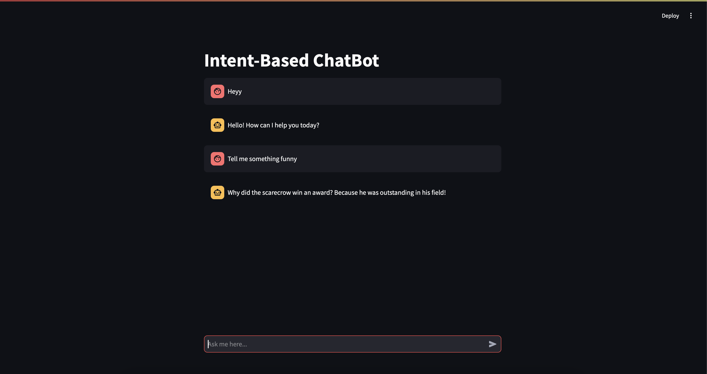

# Intent-Based Chatbot

## Project Overview

This project focuses on developing an Intent-Based Chatbot that utilizes advanced Natural Language Processing (NLP) techniques. The chatbot is designed to understand user inputs, identify specific intents, and generate contextually relevant responses. The interface is built using Streamlit, which facilitates real-time interaction with the chatbot. The core logic uses a Naive Bayes classifier for intent detection and TF-IDF (Term Frequency-Inverse Document Frequency) vectorization to convert text into numerical features for processing.

## Key Learning Objectives

- **Comprehending Intent-Based Chatbots**: Gain an in-depth understanding of the architecture and real-world applications of intent-based chatbots.
- **Mastering NLP Techniques**: Learn fundamental NLP techniques such as tokenization, intent classification, and entity recognition to process and interpret user queries effectively.
- **Building a Functional Chatbot**: Develop a fully interactive chatbot application in Python and deploy it using Streamlit for real-time engagement with users.
- **Session State Management**: Utilize Streamlit's session state feature to track and manage dynamic chat history for uninterrupted user interaction.
- **Enhancing User Experience**: Create an intuitive and responsive chatbot interface that optimizes user interaction through a clean and minimalist design.
- **Applying Machine Learning**: Implement machine learning techniques, including Naive Bayes for intent classification and TF-IDF for transforming text into meaningful features for model input.

## Tools and Technologies Utilized

- **Python**: The core programming language used for implementing the chatbot logic and NLP processing.
- **Natural Language Processing (NLP)**: Employed to analyze, interpret, and understand user input through text preprocessing techniques like tokenization and intent detection.
- **Streamlit**: A powerful framework for building interactive, real-time web applications, which serves as the user interface for the chatbot.
- **Naive Bayes Classifier**: A probabilistic machine learning algorithm used for classifying intents based on the likelihood of a given input belonging to predefined categories.
- **TF-IDF Vectorizer**: A technique used for transforming raw text into numerical vectors that represent the importance of terms within a document relative to a corpus.
- **Streamlit Session State**: Leverages Streamlit's session state functionality to track ongoing conversations and ensure that the chatbot remembers context across different user interactions.
- **Cloud Deployment (Future Scope)**: Plans to deploy the chatbot on cloud platforms such as AWS or Heroku to ensure accessibility and scalability for broader user access.

## Key Features

- **Real-Time Interaction**: Provides dynamic, responsive conversations with the user, generating prompt and relevant responses in real time.
- **Intent Recognition**: Accurately detects predefined user intents and responds accordingly, offering contextual relevance in the conversation.
- **Session History Management**: Maintains and tracks chat history, ensuring a consistent flow of interaction, even across multiple exchanges within the same session.
- **User-Friendly Interface**: A sleek, intuitive user interface built with Streamlit, designed to enhance user engagement and interaction with minimal complexity.
- **Machine Learning-Driven**: Integrates Naive Bayes for intent classification and TF-IDF for text representation, driving the chatbot’s ability to interpret and respond appropriately.
